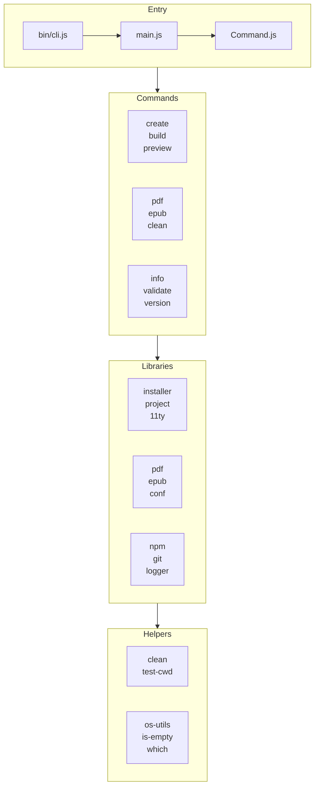
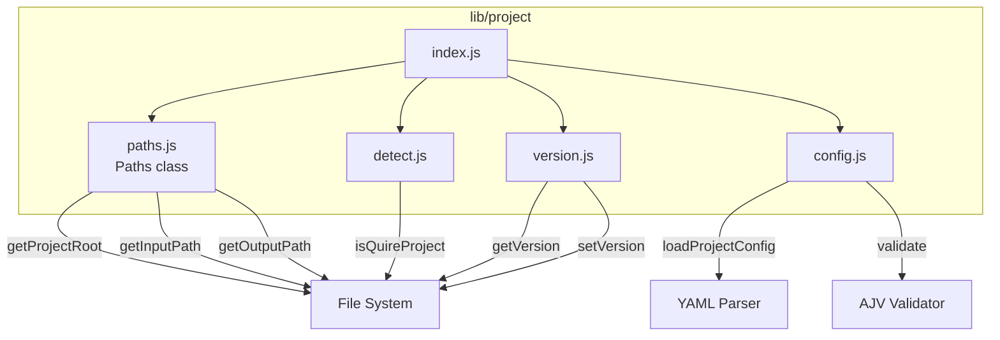
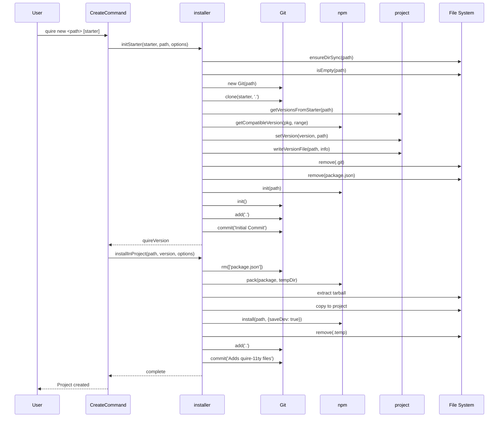
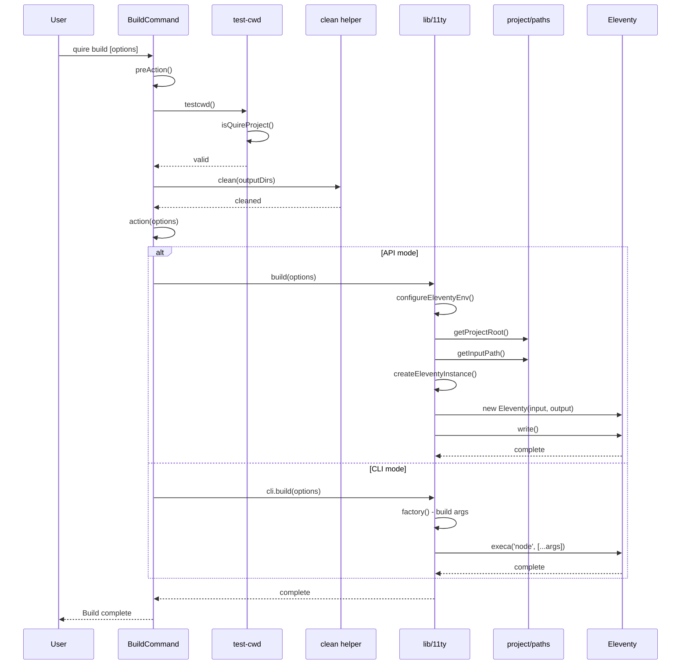
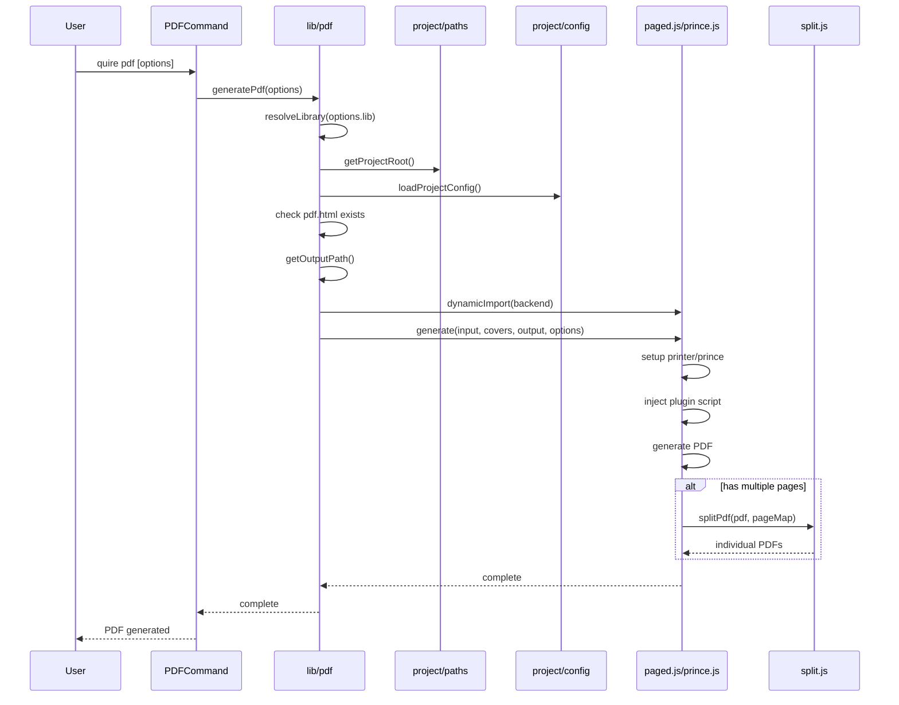
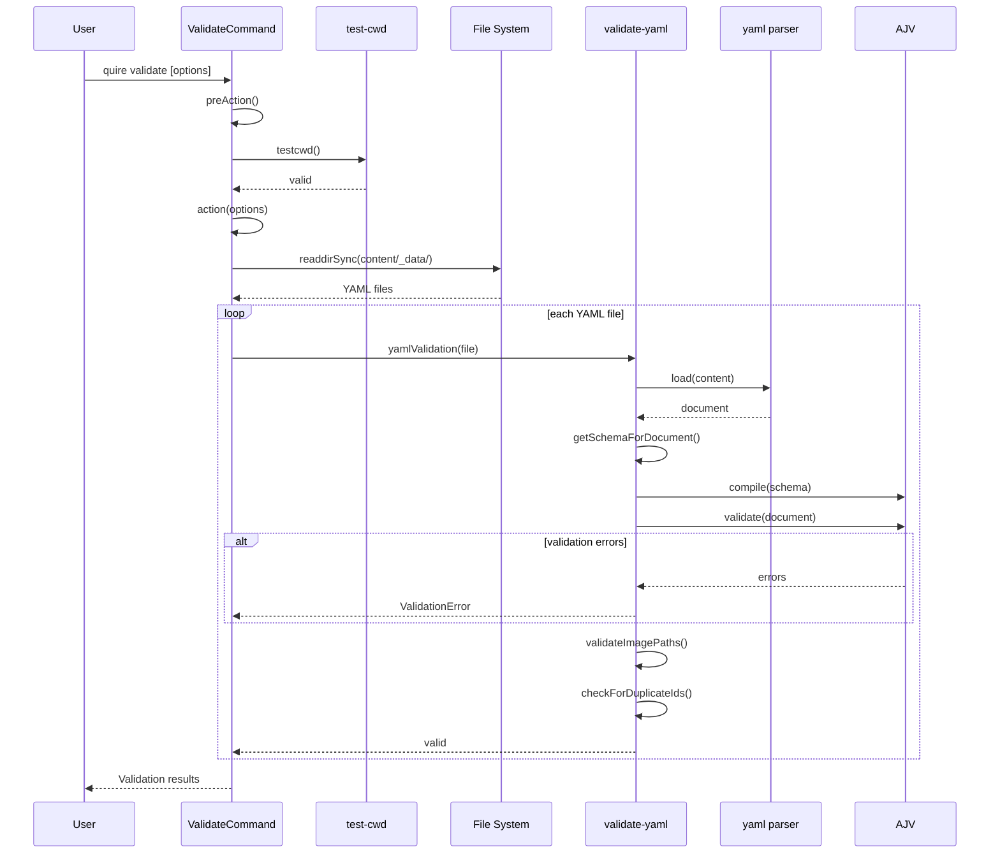

# Quire CLI Architecture

This document describes the architecture of the Quire CLI package (`@thegetty/quire-cli`), including component structure, data flows, and module dependencies.

## Overview

The Quire CLI is a command-line interface for creating and managing Quire digital publications. It uses Commander.js for command parsing and follows a modular architecture with clear separation between commands, library modules, and helpers.

## Entry Points

| File | Purpose |
|------|---------|
| `bin/cli.js` | Main executable entry point |
| `src/main.js` | Application setup and command registration |
| `src/Command.js` | Base class for all commands |

## Architecture Layers

```
┌─────────────────────────────────────────────────────────────────┐
│                         CLI Entry Point                         │
│                          (bin/cli.js)                           │
└─────────────────────────────────────────────────────────────────┘
                                │
                                ▼
┌─────────────────────────────────────────────────────────────────┐
│                         Command Layer                           │
│   create │ build │ preview │ pdf │ epub │ clean │ info │ ...    │
└─────────────────────────────────────────────────────────────────┘
                                │
                                ▼
┌─────────────────────────────────────────────────────────────────┐
│                         Library Layer                           │
│   11ty | conf | installer │ project │ pdf │ epub │ npm │ git    │
└─────────────────────────────────────────────────────────────────┘
                                │
                                ▼
┌─────────────────────────────────────────────────────────────────┐
│                         Helper Layer                            │
│       clean │ is-empty | os-utils │ test-cwd | which            │
└─────────────────────────────────────────────────────────────────┘
```

## Commands

| Command | File | Purpose |
|---------|------|---------|
| `new` | `create.js` | Create new Quire project from template |
| `build` | `build.js` | Generate static site using Eleventy |
| `preview` | `preview.js` | Run dev server with file watching |
| `pdf` | `pdf.js` | Generate PDF from built publication |
| `epub` | `epub.js` | Generate EPUB from built publication |
| `clean` | `clean.js` | Remove build outputs |
| `conf` | `conf.js` | Manage CLI configuration |
| `info` | `info.js` | Display version information |
| `validate` | `validate.js` | Validate YAML configuration files |
| `version` | `version.js` | Set quire-11ty version for project |

## Library Modules

### Core Modules

| Module | Purpose | Pattern |
|--------|---------|---------|
| `lib/11ty` | Eleventy API and CLI integration | Facade |
| `lib/conf` | CLI-level configuration management | Singleton |
| `lib/installer` | Project creation and quire-11ty installation | Exported functions |
| `lib/project` | Project paths, detection, config, versions | Class + singleton |

### External Process Facades

| Module | Purpose | Pattern |
|--------|---------|---------|
| `lib/npm` | Abstracted npm operations | Singleton |
| `lib/git` | Abstracted git operations | Class + singleton |

### Output Generation

| Module | Purpose | Backends |
|--------|---------|----------|
| `lib/pdf` | PDF generation | pagedjs, prince |
| `lib/epub` | EPUB generation | epubjs, pandoc |

### Utilities

| Module | Purpose |
|--------|---------|
| `lib/logger` | Logging facade with loglevel + chalk (log levels, colors, prefixes) |
| `lib/i18n` | Internationalization (in development) |

## Helpers

| Helper | Purpose |
|--------|---------|
| `clean.js` | Delete build artifacts using 'del' library |
| `is-empty.js` | Check if directory is empty |
| `os-utils.js` | Cross-platform dynamic imports |
| `test-cwd.js` | Verify current directory is a Quire project |
| `which.js` | Locate executable in PATH |

## Design Patterns

### Singleton Pattern
Used for global operations where a single instance is shared:
- `config` - CLI configuration
- `git` (default export) - global git operations
- `logger` - logging facade (also supports factory pattern for module-specific loggers)
- `npm` - npm CLI operations

### Class Pattern
Used for scoped operations requiring multiple instances:
- `Git` class - repository-specific operations
- `Paths` class - project path management
- `Quire11ty` class - Eleventy integration

### Façade Pattern
Provides unified interfaces over complex subsystems:
- `lib/11ty` - unified interface over Eleventy API and CLI
- `lib/pdf` - resolves and delegates to PDF backend
- `lib/epub` - resolves and delegates to EPUB backend

### Factory Pattern
Creates instances based on runtime conditions:
- `commands/index.js` - dynamically imports and instantiates commands
- `lib/11ty/cli.js` factory() - constructs Eleventy CLI arguments
- `lib/logger` createLogger() - creates module-specific loggers with custom prefixes

---

## Appendix A: Component Diagrams

### High-Level Component Architecture



### Project Module Structure



## Appendix B: Data Flow Diagrams

### Project Creation Flow (`quire new`)



### Build Flow (`quire build`)



### PDF Generation Flow (`quire pdf`)



### Validation Flow (`quire validate`)



---

## Appendix C: Module Dependencies

### Dependency Matrix

| Module | Dependencies |
|--------|--------------|
| `create` | installer, logger, fs-extra |
| `build` | 11ty, helpers/clean, helpers/test-cwd |
| `preview` | 11ty, helpers/test-cwd |
| `pdf` | lib/pdf, helpers/test-cwd |
| `epub` | lib/epub, helpers/test-cwd |
| `clean` | helpers/clean, helpers/test-cwd, project |
| `info` | npm, project, helpers/test-cwd |
| `validate` | project, helpers/test-cwd, validators |
| `version` | installer, project, helpers/test-cwd |
| `conf` | lib/conf |
| `installer` | git, npm, project |
| `11ty` | project, helpers/os-utils |
| `pdf` | project, helpers/os-utils |
| `epub` | project, helpers/os-utils |
| `npm` | helpers/which, execa |
| `git` | helpers/which, execa |

### Import Alias Reference

The CLI uses subpath imports defined in `package.json`:

| Alias | Path |
|-------|------|
| `#src/*` | `./src/*` |
| `#lib/*` | `./src/lib/*` |
| `#helpers/*` | `./src/helpers/*` |

---

## Appendix D: Testing Architecture

### Test File Conventions

| Pattern | Purpose |
|---------|---------|
| `*.spec.js` | Unit tests (command registration, API surface) |
| `*.test.js` | Integration tests (full command execution with mocks) |

### Mocking Strategy

```mermaid
graph TB
    subgraph TestFile["Test File (*.test.js)"]
        Test[Test Case]
    end

    subgraph Mocking["esmock Mocking"]
        MockFS[Mock fs-extra]
        MockNPM[Mock lib/npm]
        MockGit[Mock lib/git]
        MockLogger[Mock lib/logger<br/>{ logger: mockLogger }]
    end

    subgraph RealCode["Real Code Under Test"]
        Command[Command Class]
        Lib[Library Module]
    end

    Test --> |esmock| Command
    Test --> |inject| MockFS
    Test --> |inject| MockNPM
    Test --> |inject| MockGit
    Test --> |inject| MockLogger

    Command --> Lib
```

### Test Example Pattern

```javascript
// Example: Mocking for create.test.js
const CreateCommand = await esmock('./create.js', {
  '#lib/installer/index.js': { installer: mockInstaller },
  '#lib/git/index.js': { Git: MockGit },
  '#lib/npm/index.js': { default: mockNpm },
  '#lib/logger/index.js': { logger: mockLogger },
  'fs-extra': mockFs
})
```
